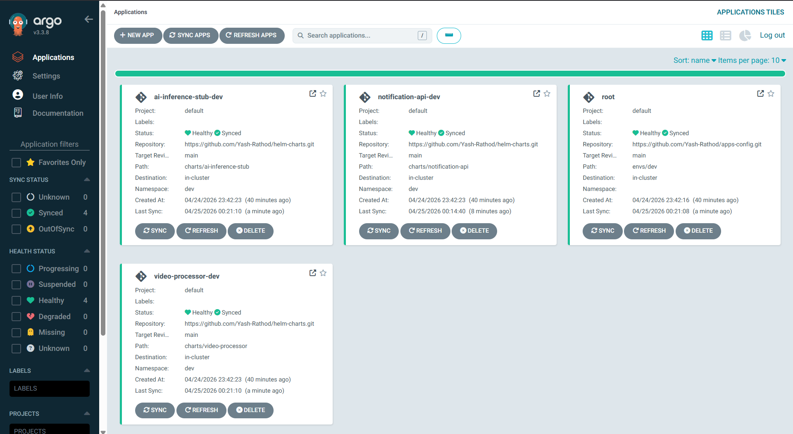

# BakTrack apps-config

GitOps source of truth for the BakTrack EKS platform. ArgoCD watches this repo and reconciles the cluster to match whatever is committed here. Part of the [BakTrack EKS Reference Architecture](https://github.com/Yash-Rathod/infra-terraform).


---

## How It Works

This repo uses the **app-of-apps** pattern:

```
bootstrap/root-app.yaml
  └─▶ ArgoCD watches envs/dev/
        ├─▶ notification-api.yaml   → deploys chart from helm-charts repo
        ├─▶ video-processor.yaml    → deploys chart from helm-charts repo
        ├─▶ ai-inference-stub.yaml  → deploys chart from helm-charts repo
        └─▶ alerts.yaml             → creates PrometheusRule in monitoring ns
```

One `kubectl apply` bootstraps everything. After that, **git is the only deployment mechanism** — no `helm install`, no `kubectl apply` for app changes.

---

## Structure

```
bootstrap/
└── root-app.yaml          # Apply once to bootstrap ArgoCD app-of-apps

envs/
├── dev/                   # Applied to live baktrack-dev cluster
│   ├── notification-api.yaml
│   ├── video-processor.yaml
│   ├── ai-inference-stub.yaml
│   └── alerts.yaml        # PrometheusRule: PodCrashLooping alert
├── staging/               # Ready to apply — not running (cost saving)
└── prod/                  # Ready to apply — not running (cost saving)
```

---

## Bootstrap (one time only)

```bash
kubectl apply -f bootstrap/root-app.yaml
```

ArgoCD picks up `envs/dev/`, creates child Applications, and syncs the cluster. All four apps show **Healthy** and **Synced** within minutes.



Drilling into any application shows the full Kubernetes resource tree managed by this repo: Deployment → ReplicaSet → Pods, Service, ServiceAccount, ServiceMonitor.


All future changes are driven by git commits — no manual `kubectl` or `helm` commands needed.

---

## Deploying a New Version

You do not deploy from this repo manually. The CI pipeline in [`mock-services`](https://github.com/Yash-Rathod/mock-services) updates the image tag automatically:

```bash
# What CI does after building and pushing an image:
sed -i "s|tag:.*|tag: <new-sha>|" envs/dev/notification-api.yaml
git commit -am "chore(dev): bump notification-api to <sha>"
git push
# ArgoCD detects the diff within 3 minutes and rolls out
```

After a successful CI run, the three service pods in the `dev` namespace are running the new image:


---

## Sync Policy

All applications are configured with:

```yaml
syncPolicy:
  automated:
    prune: true      # removes resources deleted from git
    selfHeal: true   # reverts manual kubectl changes
  syncOptions:
    - CreateNamespace=true
```

This means the cluster **self-heals** — any manual change made with `kubectl` will be reverted by ArgoCD within minutes.

---

## Observability

`envs/dev/alerts.yaml` deploys a `PrometheusRule` to the `monitoring` namespace:

- **PodCrashLooping** — fires if any pod restarts more than once in 5 minutes, for 2 consecutive minutes

Verify it loaded:
```bash
kubectl -n monitoring get prometheusrule baktrack-alerts
```

---

## License

MIT © 2026 Yash Rathod
